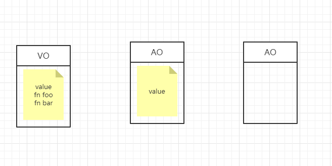
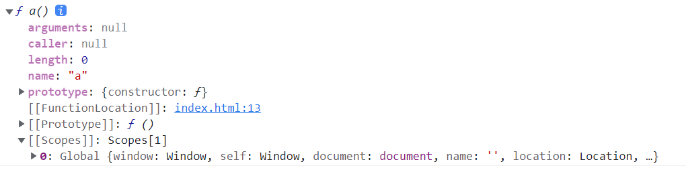
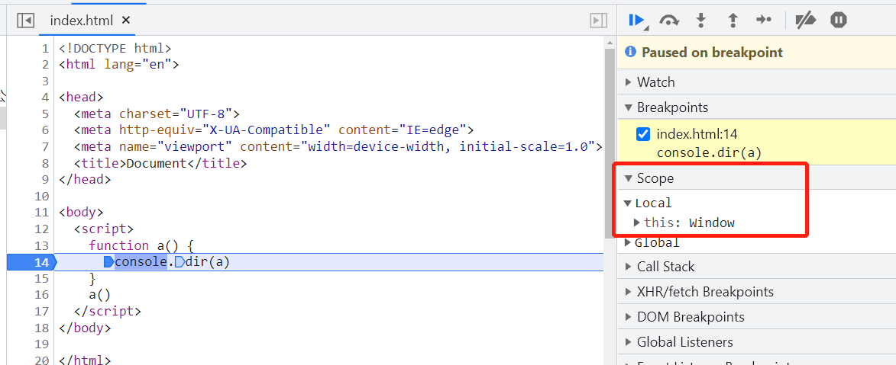
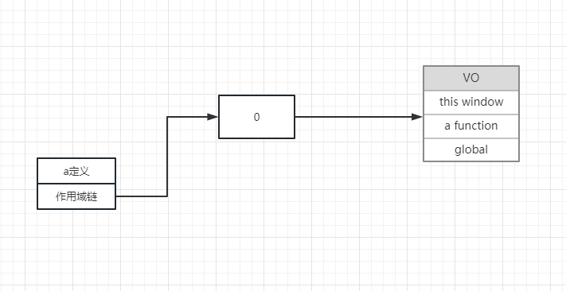
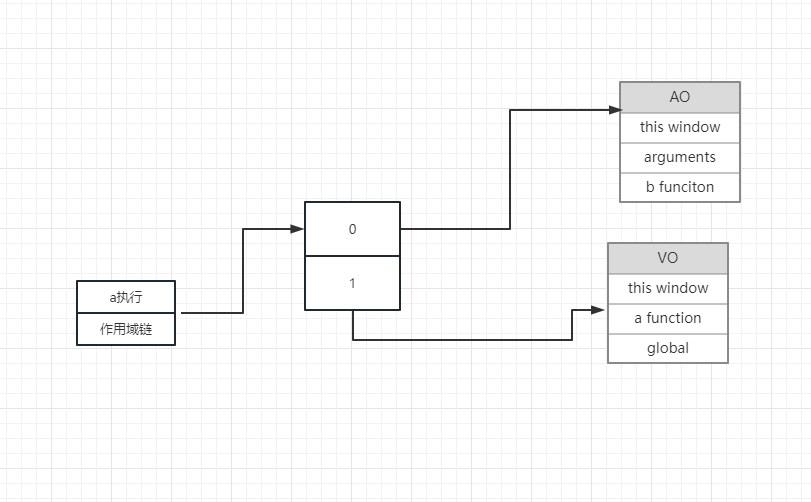
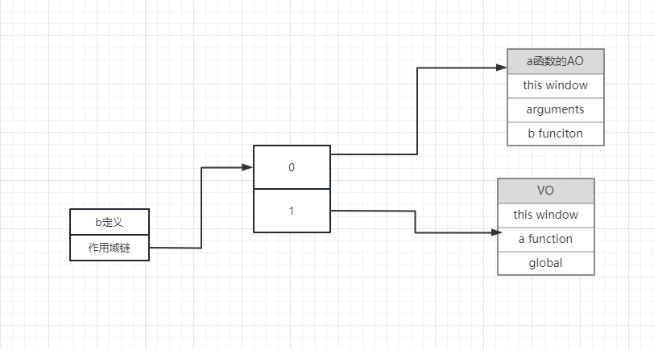
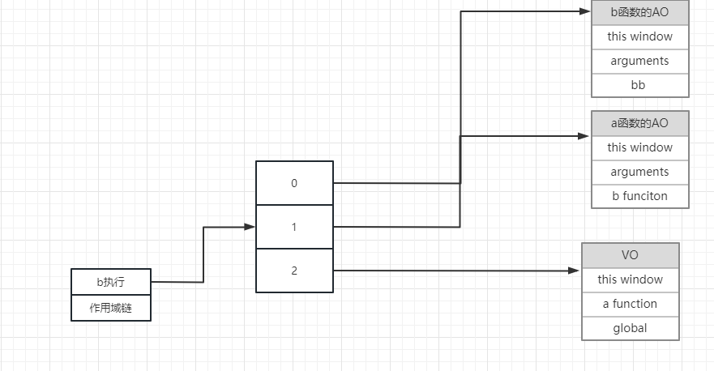
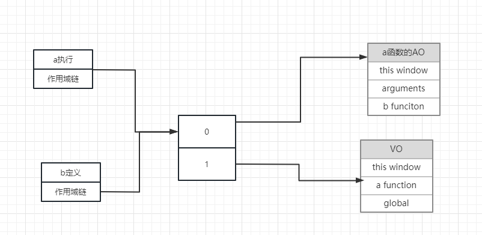

# JAVASCRIPT部分

## 📕闭包，闭包形成的底层原理(画图讲解)，闭包的实战应用

### 作用域

作用域是指程序源代码中定义的范围 分为全局作用域和局部作用域也叫函数作用域
作用域规定了如何设置变量，也就是确定当前执行代码对变量的访问权限
函数作用域采用词法作用域，也就是静态作用域

- 所谓词法作用域就是在函数定义的时候 就已经确定了

```js
var value = 1;
function foo() {
    console.log(value);
}

function bar() {
    var value = 2;
    foo();
}

bar();   // 1
```

- 变量对象
  变量对象是当前代码段中，所有的变量(变量 函数 形参 arguments)组成的一个对象
  变量对象是在执行上下文中被激活的，只有变量对象被激活了，在这段代码中才能使用所有的变量
  变量对象分为全局变量对象和局部变量对象
  全局简称为 Variable Object VO 函数由于执行才被激活 称为 Active Object AO

```js
var value = 1;
function foo() {
    console.log(value);
}

function bar() {
    var value = 2;
    foo();
}

bar();   // 1
```



### 作用域链

在js中, 函数存在一个隐式属性 [[scopes]], 这个属性用来保存当前函数的执行上下文环境, 由于在数据结构上是链式的, 因此也被称作是作用域链, 我们可以把它理解为一个数组
可以理解为是一系列的AO对象所组成的一个链式结构

```js
function a(){}
console.dir(a) // 打印结构

```

ss

- 当函数被调用后

```js
function a(){
  console.dir(a)
}
a()
```

- a函数的执行上下文如下
  
  因此我们可以得出一个结论: [[scopes]] 属性在函数声明时产生, 在函数调用时更新
  即: 在函数被调用时, 将该函数的AO对象压入到[[scopes]]中


### 作用域链的作用

作用域链的作用是保证执行环境里有权访问的变量和函数是有序的，作用域链的变量只能向上访问，变量访问到window对象即被终止，作用域链向下访问变量是不被允许的

最直观的表现就是:

- 函数内部可以访问到函数外部声明的变量

```js
var a = 100
function fn(){
  console.log(a)
}
fn() // 100
```

- 函数外部访问不到函数内部的变量

```js
function fn() {
  var a = 100
}
fn()
console.log(a) // a is not defined
```


### 画出下面代码执行的作用域链

```js
    var global
    function a() {
      var aa = 123
      function b() {
        var bb = 234
      }
      b()
    }
    a()
```

- 第一步 a函数生成 
  

- 第二步 a函数调用
  

- 第三步 b函数生成 （a函数调用导致b函数生成）
  

- 第四步 b函数调用
  

### 函数执行完就销毁 所谓销毁就是断掉图中的线 

### 思考 a函数调用 和 b函数生成是不是同一个作用域链 

- 是的 下面代码验证

```js
var global
    function a() {
      // 到这个里面来了 
      var aa = 123
      // b函数定义
      function b() {
        // 到这里面来了 
        var bb = 234
        aa = 0
      }
      // b执行
      b()
      console.log(aa);
    }
    // a执行 
    a()
    // 打印aa的结果 如果是00 说明是同一个 没有分离 
```

- 那么就有了下面的图解



### 看看闭包

```js
var global
    function a() {
      // 到这个里面来了 
      var aa = 123
      // b函数定义
      function b() {
        console.log(aa);
      }
      return b
    }
    // a执行 
    var res = a()
    res()
```

- 底层原理结合图9 讲解 ·

### 经过上述的讲解 那么谈谈闭包的定义

- 就是能够读取其他函数内部变量的函数。

### 闭包的实战应用

1. 回调函数

```js
function add(num1, num2, callback) {
    var sum = num1 + num2;
    if (typeof callback === 'function') {//类型判断，确认是一个函数
      callback(sum);
    }
}

add(1, 2, function (sum) {
  console.log(sum);
})


```

2. 手写js的方法 手写bind方法

```js
let foo = {
  name: 'jill'
}
function getName () {
  console.log(this.name)
}
Function.prototype.myBind = function (obj) {
  // 将当前函数的this 指向目标对象
  let _self = this
  return function () {
    return _self.call(obj)
  }
}
 
let getFooName = getName.myBind(foo)
getFooName() 
```

3. 防抖节流函数

4. 单例模式

5. 定时器传参

```js
    function fn(a) {
      return function () {
        console.log(a)
      }
    }

    setTimeout(fn(123), 1000)
```

6. 利用闭包判断数据类型

```js
function isType(type) {
  return function (target) {
    return `[object ${type}]` === Object.prototype.toString.call(target)
  }
}
const isArray = isType('Array')
console.log(isArray([1, 2, 3]));				// true
console.log(isArray({}));	

```

7. 封装私有变量和函数

```js
function createPerson(name) {
    var age = 0;
    return {
        getName: function() {
            return name;
        },
        getAge: function() {
            return age;
        },
        setAge: function(newAge) {
            age = newAge;
        }
    };
}
var person = createPerson("John");
console.log(person.getName()); // "John"
console.log(person.getAge()); // 0
person.setAge(30);
console.log(person.getAge()); // 30

```

8. 高阶函数

-  高阶函数除了可以接受函数作为参数外，还可以把函数作为结果值返回。
-  实现对一个数组的求和

```js
function sum(arr) {
    return arr.reduce(function (x, y) {
        return x + y;
    });
}
 
sum([1, 2, 3, 4, 5]); // 15

```

-  但是，如果不需要立刻求和，而是在后面的代码中，根据需要再计算怎么办？可以不返回求和的结果，而是返回求和的函数！

```js
function lazy_sum(arr) {
    var sum = function () {
        return arr.reduce(function (x, y) {
            return x + y;
        });
    }
    return sum;
}
var f = lazy_sum([1, 2, 3, 4, 5]); 
```

9. 迭代器（执行一次函数往下取一个值）

```js
var arr =['aa','bb','cc'];
function incre(arr){
    var i=0;
    return function(){
        //这个函数每次被执行都返回数组arr中 i下标对应的元素
         return arr[i++] || '数组值已经遍历完';
    }
}
var next = incre(arr);
console.log(next());//aa
console.log(next());//bb
console.log(next());//cc
console.log(next());//数组值已经遍历完
```

10. 缓存
    //比如求和操作，如果没有缓存，每次调用都要重复计算，采用缓存已经执行过的去查找，查找到了就直接返回，不需要重新计算  

```js
var fn=(function(){
  var cache={};//缓存对象
  var calc=function(arr){//计算函数
      var sum=0;
      //求和
      for(var i=0;i<arr.length;i++){
          sum+=arr[i];
      }
      return sum;
  }
  return function(){
      var args = Array.prototype.slice.call(arguments,0);//arguments转换成数组
      var key=args.join(",");//将args用逗号连接成字符串
      var result , tSum = cache[key];
      if(tSum){//如果缓存有   
          console.log('从缓存中取：',cache)//打印方便查看
          result = tSum;
      }else{
          //重新计算，并存入缓存同时赋值给result
          result = cache[key]=calc(args);
          console.log('存入缓存：',cache)//打印方便查看
      }
      return result;
  }
})();
fn(1,2,3,4,5);
fn(1,2,3,4,5);
fn(1,2,3,4,5,6);
fn(1,2,3,4,5,8);
fn(1,2,3,4,5,6);
```


## 📕预编译的常见面试题，万能解题公式

预编译是上下文创建之后, js代码执行前的一段时期, 在这个时期, 会对js代码进行预处理

### 全局预编译

全局上下文创建后，会生成**变量对象VO**

- VO首先寻找变量声明，将var声明的变量作为VO对象的属性名，值为undefined

- 然后寻找函数声明，属性值为函数本身

- 如果函数名与变量名冲突，函数声明会将变量声明覆盖。
  
  ```js
  console.log(a)//function    
  var a = 100;
  function a () { }
  console.log(a)//100
  ```

**变量声明—>函数声明**

### 函数预编译

函数上下文创建后，会生成**变量对象AO（活动对象）**

- 寻找变量声明, 变量名作为AO对象的属性名, 属性值置为 undefined

- **寻找形参, 形参名作为AO对象的属性名, 属性值置为 undefined**

- **将实参的值赋予形参, 即替换 AO对象中形参的属性值**

- 寻找函数声明, 函数名作为AO对象的属性名, 属性值为函数本身

- 如果函数名与变量名冲突, 函数声明会将变量声明覆盖
  
  ```js
  function a(b, c) {
  console.log(b); //1             
  var b = 0
  console.log(b); //0       
  var b = function () {
    console.log('bbbb')
  }    
  console.log(c); //undefined       
  console.log(b); //function               
  }
  a(1)
  ```

**变量声明—>形参—>实参—>函数声明**

### 几道面试题（实际演练🏆）

```js
function fn (a, c) {
  console.log(a)//function
  var a = 123
  console.log(a)//123
  console.log(c)//function
  function a() {}
  if (false) {
      var d = 678
  }
  console.log(d)//undefined
  console.log(b)//undefined
  var b = function () {}
  console.log(b)//function
  function c () {}
  console.log(c)//function
}
fn(1, 2)
```

- 所有var声明的变量会声明提前，赋值为undefined，覆盖了全局的foo

```js
var foo = 1;
function bar() {
 //由于var变量声明提前，这相当于有一个var foo，但是没有赋值
 console.log(foo); //undefined
 if (!foo) {
 var foo = 10; //相当于 foo = 10；
 }
 console.log(foo); //10
} 
bar();
```

- 使用函数声明定义的函数会声明提前，可以随意在函数前后调用

- 函数表达式不能执行的原因是：var声明提前，但是赋值undefined，undefined()会报错

```js
function fn () {
    func() //声明式
    //函数表达式  这里会覆盖提前的函数声明
    var func = function () {
        console.log('表达式')
    }
    //函数声明
    function func() {
        console.log('声明式')
    }
    func() //表达式 原因：函数表达式将函数声明覆盖了
}
fn()
```

```js
function test(d) {
    console.log(b);
    if (a) {
        b = 100;
    }
    console.log(b);
    c = 4;
    console.log(d);//undefined
    var d = 20;
    console.log(d);//20
}
var a = 10;
var b = 10;
test(3);
console.log(c);
```

---

## 📕如何判断数组和对象，有哪些方式，实际开发中用的是那种方式

## 如何判断数组和对象

1. instanceof

```js
let arr = []
consple.log(arr instanceof Array)
```

缺点： instanceof 底层原理是检测构造函数的 prototype 属性是否出现在某个实例的原型链上，如果实例的原型链发生变化，则无法做出正确判断。

```js
    let arr = []
    arr.__proto__ = function(){}
    console.log(arr instanceof Array)
```

2. Object.getPrototypeOf()，

   ```js
   const arr = []
   
   arr.__proto__ = function(){}
   
   console.log(Object.getPrototypeOf(arr) === Array.prototype
   ```

3. 借助于constructor 

```js
    let arr = []
    console.log(arr.constructor === Array) // true
```

缺点： 如果 arr 的 constructor 被修改，则无法做出正确判断。

```js
let arr = []
arr.constructor = function() {}
console.log(arr.constructor === Array) // false
```

3. 根据 Object.prototype.toString.call()

```js
let arr = []
console.log(Object.prototype.toString.call(arr) === '[object Array]') // true

// 修改原型链也不会有影响 
let arr = []
arr.__proto__ = function() {}
console.log(Object.prototype.toString.call(arr) === '[object Array]') // true

// 为什么一定要加.call 防止被改写
let arr = []
Object.prototype.toString = function(){return 123}
console.log(Object.prototype.toString(arr) ) // true

// 为什么不直接调用toString 


```

4. isArray

```js
Array.isArray()
Array.isArray() // 是 ES6 新增的方法，专门用于数组类型判断，原理同上。

let arr = []
console.log(Array.isArray(arr)) // true
// 修改原型链不会对它造成任何影响。

let arr = []
arr.__proto__ = function() {}
// console.log(Array.isArray(arr)) // true

```

5. 封装

```js
function isType(type) {
  return function (target) {
    return `[object ${type}]` === Object.prototype.toString.call(target)
  }
}

const isArray = isType('Array')
console.log(isArray([1, 2, 3]));				// true
console.log(isArray({}));	

```

## 📕腾讯另类的数组去重考察方式 

​	请你找出任意一个html当中所有的不重复的标签

## 📕深拷贝与浅拷贝

JavaScript中存在两大数据类型：基本数据类型 和 引用数据类型。基本数据类型存储在栈空间中，引用数据类型存储在堆内存中，其变量是指向堆内存中实际对象的引用地址值。

### 赋值

当我们把一个对象赋值给一个新的变量时，复制的是对象在栈内存中的引用地址值，而不是堆中的数据。因此无论哪个对象发生改变，都会改变堆中实际对象的内容。

### 浅拷贝

对一个对象进行浅拷贝时，如果数据是基本数据类型，则会直接拷贝数据值。而如果数据是引用数据类型，则会拷贝引用地址值。

**在JavaScript中存在浅拷贝的现象有：**

- `Object.assign()`
- `Array.prototype.concat()`
- `Array.prototype.slice()`
- 拓展运算符

### 深拷贝

深拷贝会在堆空间中创建一个新的对象，两个对象属性完全相同，但是两个栈中变量对应着两个不同的地址。

**常用深拷贝的方式有：**

- lodash中定义的_.cloneDeep()方法
  
  ```js
  const _ = require('lodash');
  const obj1 = {
      a: 1,
      b: { f: { g: 1 } },
      c: [1, 2, 3]
  };
  const obj2 = _.cloneDeep(obj1);
  console.log(obj1.b.f === obj2.b.f);// false
  ```

- jQuery.extend()
  
  ```js
  const $ = require('jquery');
  const obj1 = {
      a: 1,
      b: { f: { g: 1 } },
      c: [1, 2, 3
  ]};
  //extend 第一个参数：是否深度拷贝，默认false  第二个：合并的目标对象
  //第三个以后：可设置多个被合并对象
  const obj2 = $.extend(true, {}, obj1);
  console.log(obj1.b.f === obj2.b.f); // false
  ```

- JSON.stringify()
  
  ```js
  const obj2=JSON.parse(JSON.stringify(obj1));
  ```

弊端：会忽略`undefined`、`symbol`和`函数`

- 手写循环递归

```js
function deepClone(obj = {}) {
    if (typeof obj !== 'object' || obj == null) {
        // obj 是 null ，或者不是对象和数组，直接返回 函数不用深拷贝
        return obj
    }

    // 初始化返回结果
    let result
    if (obj instanceof Array) {
        result = []
    } else {
        result = {}
    }

    for (let key in obj) {
        // 保证 key 不是原型的属性
        if (obj.hasOwnProperty(key)) {
            // 递归调用！！！
            result[key] = deepClone(obj[key])
        }
    }

    // 返回结果
    return result
}
```


## 📕阿里this指向笔试题，做this笔试题的高效快捷方法
```js
        var name = 111
        var obj1= {
            name:'obj1',
            say:function(){
                console.log(this.name)
            }
        }

        obj1.say()  
        var res = obj1.say
        res()
        var obj2 = {
            name:'obj2',
            say:function(fn){
                fn()
            }
        }
        obj2.say(obj1.say)
        obj2.say = obj1.say
        obj2.say()
```
## 📕谈谈bind、call、apply 区别？如何手写实现一个bind?

`call`、`apply`、`bind`作用都是改变函数执行时的上下文。

### apply

参数：`apply`接受两个参数，第一个参数是`this`的指向，第二个参数是函数接受的参数，以数组的形式传入

要点：

- 改变`this`指向后原函数会立即执行，且此方法只是临时改变`this`指向一次

- 当第一个参数为`null`、`undefined`的时候，默认指向`window`(在浏览器中)

### call

参数：`call`方法的第一个参数也是`this`的指向，后面传入的是一个参数列表

其余和aplly一样

### bind

参数：第一参数也是`this`的指向，后面传入的也是一个参数列表(但是这个参数列表可以分多次传入)

要点：改变`this`指向后不会立即执行，而是返回一个永久改变`this`指向的函数

```js
function fn(...args){
    console.log(this,args);
}
let obj = {
    myname:"张三"
}

const bindFn = fn.bind(obj); // this 也会变成传入的obj ，bind不是立即执行需要执行一次
bindFn(1,2) // this指向obj
fn(1,2) // this指向window
```

### 手写实现call

```js
        var obj = {
            name:'张三',
        }

        var obj2 = {
            say:function(){
                console.log(this.name)
            }
        }
        Function.prototype.myCall = function (ctx, ...args) {
            if(typeof this !=='function'){
                return 
            }
            ctx.fn = this; // this就是 .call前的函数 这里指fn
            ctx.fn(...args); // 执行函数
            delete ctx.fn; // 函数执行完毕 删除
        }

        obj2.say.myCall(obj)


        // Function.prototype.myCall = function (ctx, ...args) {
        //     let key = Symbol("key")
        //     ctx[key] = this; // this就是 .call前的函数 这里指fn
        //     let result = ctx[key](...args); // 执行函数
        //     delete ctx[key]; // 函数执行完毕 删除
        //     return result
        // }
```

---


## 📕说说你对事件循环的理解

JavaScript是一种单线程非阻塞语言，而实现非阻塞的方法就是事件循环。

在JavaScript中所有的任务都可以分为：**同步任务** 和 **异步任务**，同步任务会直接进入主线程立即执行，异步任务则会放入消息队列。当主线程的任务执行完毕以后，才会执行消息队列中的任务。

除此之外，异步任务还分为 **微任务** 和 **宏任务**。

常见的宏任务有：script(整体代码), setTimeout, setInterval, setImmediate, I/O，DOM事件、Ajax等

常见的微任务有： Promise.then() .catch()，process.nextTick，MutationObserver（DOM 监听）、async/await

**注意：new Promise本身是同步任务**

### 事件循环的执行流程

1. JavaScript 代码在执行时，会将同步任务压入执行栈中，按照后进先出的顺序依次执行。

2. 如果遇到异步任务，则放入任务队列中，等待执行。

3. 当执行栈中的同步任务全部执行完毕后，事件循环会从任务队列中取出一个任务（按照队列的先进先出原则），将其对应的回调函数压入执行栈中执行。

4. 如果在执行异步任务的回调函数时，又产生了异步任务，它们会被放入任务队列中等待执行。

5. 重复以上步骤，直到任务队列中没有任务为止，事件循环终止。

6. 对于微任务和宏任务，每当上一轮的宏任务完成后就会查看微任务的事件队列，将里面的微任务依次执行完，进行浏览器渲染，然后开始新的宏任务

举个例子：

```js
var btn = document.getElementById('button')
btn.addEventListener('click', () => {
  Promise.resolve().then(() => console.log(1))
  console.log('listener 1')
})
btn.addEventListener('click', () => {
  Promise.resolve().then(() => console.log(2))
  console.log('listener 2')
})
//这里当点击事件发生后，会先触发第一个click，先输出listener 1，再输出1；
//再触发第二个click,先输出 listener 2，再输出2

btn.click();//系统触发click
//当系统发生click事件后，会同时触发两个click，这个时候就会优先执行两个同步任务，输出
//listener 1 和 listener 2
//然后依次触发两个微任务，输出 1  2
```

---

## 📕说说Ajax原理是什么，如何实现

Ajax是通过通过XMLHttpRequest对象来向服务器发异步请求，从服务器获得数据，然后用javascript来操作DOM而更新页面。

XMLHttpRequest是ajax的核心机制，它是在IE5中首先引入的，是一种支持异步请求的技术。从而使JavaScript可以及时向服务器提出请求和处理响应，而不阻塞用户。**达到无刷新的效果**。

### Ajax实现过程

#### 1. 创建Ajax核心对象`XMLHttpRequest`(记得考虑兼容性)

```js
let xhr = null;
if (window.XMLHttpRequest) {// 兼容 IE7+, Firefox, Chrome, Opera, Safari  
    xhr = new XMLHttpRequest();  
} else {// 兼容 IE6, IE5 
    xhr = new ActiveXObject("Microsoft.XMLHTTP");  
}
```

#### 2. 传入请求方式和请求地址

```js
xhr.open(method, url, [async][, user][, password])
```

参数说明：

- `method`：表示当前的请求方式，常见的有`GET`、`POST`

- `url`：服务端地址

- `async`：布尔值，表示是否异步执行操作，默认为`true`

- `user`: 可选的用户名用于认证用途；默认为`null`

- `password`: 可选的密码用于认证用途，默认为`null`

#### 3. 给服务端发送请求

通过 `XMLHttpRequest` 对象的 `send()` 方法，将客户端页面的数据发送给服务端

```js
xhr.send([body])
```

`body`: 在 `XHR` 请求中要发送的数据体，如果不传递数据则为 `null`

如果使用`GET`请求发送数据的时候，需要注意如下：

- 将请求数据添加到`open()`方法中的`url`地址中
- 发送请求数据中的`send()`方法中参数设置为`null`

#### 4. 获取服务器与客户端的响应数据

可以使用`onreadystatechange()` 或 `onload()`，区别在于前者用于监听`XMLHttpRequest.readyState`属性，只要其值发生改变就触发。而后者只有处于状态码4，请求已完成，响应已就绪的情况下，才会进入`onload()`

需要说明的是`XMLHttpRequest.readyState`属性一共有5个状态值：

- `0`：未初始化 — 尚未调用.open()方法；
- `1`：启动 — 已经调用.open()方法，但尚未调用.send()方法；
- `2`：发送 — 已经调用.send()方法，但尚未接收到响应；
- `3`：接收 — 已经接收到部分响应数据；
- `4`：完成 — 已经接收到全部响应数据，而且已经可以在客户端使用了；

```js
const request = new XMLHttpRequest()
request.onreadystatechange = function(e){
    if(request.readyState === 4){ // 整个请求过程完毕
        if(request.status >= 200 && request.status <= 300){
            console.log(request.responseText) // 服务端返回的结果
        }else if(request.status >=400){
            console.log("错误信息：" + request.status)
        }
    }
}
request.open('POST','http://xxxx')
request.send() 
```

### 封装Ajax

```js
function ajax(options){
    let xhr = new XMLHttpRequest();

    //处理传入参数
    options = options || {};
    options.type = (options.type || "GET").toUpperCase();
    option.dataType = options.dataType || "json";
    const params = options.data;

    //发送请求
    if(options.type == "GET"){
        xhr.open("GET",options.url+"?"+params,true);
        xhr.send(null)
    }else{
        xhr.open("POST",options.url,true);
        xhr.send(params);
    }
    xhr.onreadstatechange = function(){
        if(xhr.readstate===4) {
            let status = xhr.status;
            if(status >=200 && status<=300){
                options.sucess && options.success(xhr.responseText,xhr.responseXML)
            } else {
                options.fail && options.fail(status)
            }
        }
    }
}
```

使用方式如下

```js
ajax({
    type: 'post',
    dataType: 'json',
    data: {},
    url: 'https://xxxx',
    success: function(text,xml){//请求成功后的回调函数
        console.log(text)
    },
    fail: function(status){////请求失败后的回调函数
        console.log(status)
    }
})
```

---

